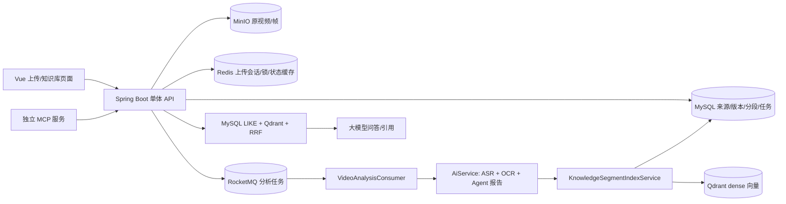

# 当前后端架构判断与改进清单

审计时间：2026-09-28；审计对象：`DOVideo-AI` 当前源码、正在运行的本机服务、MySQL 只读聚合数据。本文描述**真实现状和待做改进**，不是已完成清单。产品目标按已确认的首期场景：个人本地视频知识库，供自己的 Agent 经 MCP 使用，中文课程、B 站学习视频为主，文字证据优先，最长考虑约 20 小时课程。

## 一句话判断

当前后端是一个**具备若干视频解析、索引和问答组件的原型系统**，并非稳定的“上传即自动入库、随时供 Agent 检索”的视频知识库。已有其他语料成功入库，但截图中的新批次在上传后断链。首要改造是把**确定性的知识入库任务**从“生成完整 Agent 分析报告”中拆出，建立可恢复的任务真源、索引发布和真实状态反馈；Milvus 不是当前瓶颈。

## 1. 当前系统实际长什么样

| 环节 | 源码中的实际能力 | 运行/业务判断 |
| --- | --- | --- |
| 上传 | 5 MiB 分片、Redis 会话、MinIO 分片和合并、同用户 MD5 去重；浏览器与服务端均限 410 片，约 2 GiB。 | 上传本身能工作；长课程单文件不保证能进入系统。完成上传后才尝试投递分析，投递结果没有进入上传响应。 |
| 来源组织 | MySQL 有知识空间、目录、来源、来源版本、分段、标签/审计等模型。 | 资产层确实存在；创建来源只代表 `PENDING`，不代表视频被解析或可检索。 |
| 异步任务 | RocketMQ 消费、Redisson 锁、Redis 去重、MySQL `analysis_tasks` 台账、失败记录和 checkpoint。 | 台账写入和上传后投递采取尽力而为；缺少“每个上传必须有入库 job”的不变量和自动对账。 |
| 视频解析 | FFmpeg 每 60 秒切音频，第三方 ASR 顺序调用；关键帧 FFmpeg 提取，差异哈希去重，本机 Tesseract OCR；按 1 分钟窗口合并。 | 真正有解析代码和旧语料实绩；ASR 分片没有逐片持久化 checkpoint，单任务有超时，约 20 小时单文件尚无可验证支持。 |
| 检索分段 | 5 分钟块调用模型做摘要，最终写入的知识 segment 为其中的 1 分钟原始窗，摘要复制到多个 segment；每段再次调用 embedding。 | 原文时间戳可追溯，但粒度偏机械、摘要重复、长课程调用次数高。模型产出的摘要是派生材料。 |
| 索引 | MySQL `knowledge_segments` + Qdrant；默认 embedding 为 BGE-M3 dense。 | Qdrant 是现行库，Milvus 没有实现；MySQL 与向量库没有原子发布机制，失败/重建易不一致。 |
| 检索问答 | Qdrant dense、MySQL `LIKE` 词法召回、RRF、问答引用逐字校验；Vue 有问答和时间戳回跳。 | 旧空间能回答；词法查询先限 40 行再评分，中文长语料容易漏召回；引用原文验证不等于每条结论的语义正确。 |
| MCP | 独立 Java MCP 服务已有列空间、搜证据、取证据、问答 4 个只读工具，经后端 API 访问。 | 个人单账号可用；多个客户端 token 仍共用一个上游账号，不能据此宣称已有多用户权限隔离。`ask` 省略空间与 `search` 省略空间的行为也不一致。 |

服务运行形态是 Spring Boot 与 MCP 在本机进程运行，MySQL/Redis/MinIO/Qdrant/RocketMQ 在 Docker Compose。`/health` 返回的 `UP` 仅证实 MySQL 和 Redis 通，不证明视频解析、模型、Qdrant、MQ、MCP 可用。

## 2. 截图这 13 个视频：已核查的事实

只读查询 `owner_user_id=20, space_id=14`：

| 指标 | 当前值 | 含义 |
| --- | ---: | --- |
| 知识来源 `PENDING` | 13 | 截图所示 13 条均未 READY。 |
| 可检索 segment | 0 | 对这批视频提问不可能得到它们的时间戳证据。 |
| 无 `analysis_tasks` 记录 | 8 | 不能证明真正投递成功；需用当时日志区分限额、投递失败、旧版本或其他原因。 |
| `FAILED/BUDGET_EXHAUSTED` | 5 | 5 条都有 `media:context` 和 `media:chunks` checkpoint，但没有知识 segment。报告生成预算耗尽阻断了该批入库。 |
| 全库其他来源 READY | 21 | 能力不是完全不存在；问题集中在新视频的稳定自动入库链路。 |

**部署版本差异**：当前后端进程启动于 2026-09-28 15:34；`feat(media): uploads auto-enter the analysis pipeline` 提交于 15:39。工作区还有 5 个未提交的服务端/测试改动。运行进程没有可见的代码版本指纹，不能认为当前服务已经运行了最新源码。上述 8 条是在 10:12–10:13 创建的，尤其不能用后来提交的代码倒推它们当时会自动投递。

## 3. 改进清单：按阻断程度排序

### P0：先把“上传后能入库”变成可靠事实

| 编号 | 当前问题 | 应做改进 | 验收办法 |
| --- | --- | --- | --- |
| P0-1 | 上传完成后 `MediaController.dispatchDefaultAnalysis` 吞掉异常，`AnalysisDispatchService` 的 `RATE_LIMITED/FAILED` 没变成用户可见的持久状态。 | 上传成功时，在 MySQL 原子写媒体、来源、`ingest_job`、outbox；异步投递 MQ。每个来源必须能找到对应入库 job，投递失败由调度器重试与告警。 | 上传 10 个真实视频，10 个都查得到 job；关闭 MQ 后恢复，所有 job 最终仍能投递。 |
| P0-2 | 知识入库依附 `AiService.asyncAnalyze` 的 Planner/Executor/Critic 报告，5 个视频耗尽报告 token 后未入库。 | 建独立 `INGEST_VIDEO` 工作流：探测、字幕/ASR、可选 OCR、归一化、分段、embedding、发布索引。报告、章节总结、测验作为可选后续任务，失败不回滚知识 READY。 | 关闭报告模型或设置很低报告预算，仍可从视频提问并打开时间戳证据。 |
| P0-3 | 当前修补稿把 `indexKnowledge()` 提前，但消费者预算异常仍调用 `markIndexFailed()`；该方法无条件设置 FAILED。且 `indexKnowledge()` 自己吞异常，分析任务仍可能标记完成。 | 分开 `ingestStatus` 与 `reportStatus`；只由索引 job 决定知识 READY/FAILED。失败处理不得覆写已发布的 READY generation，任务完成必须核验索引就绪条件。 | 注入“索引成功、报告预算失败”和“报告成功、索引失败”两种故障，状态与可查询结果一致。 |
| P0-4 | 先删旧 MySQL segment、再清旧向量、逐条 embedding、再写新向量；跨存储失败可能留下不一致。 | 建新 index generation，批量生成/写入并校验数量与可查性，MySQL 原子切换 active generation，异步删除旧 generation；增加对账任务。 | 在写入每一步注入故障，旧 READY 仍可查询、不会返回孤儿向量；重试幂等。 |
| P0-5 | 前端把无任务和失败的来源都算“排队”，ETA 是固定公式；健康检查只有 MySQL/Redis。 | 后端统一返回 `NO_JOB/QUEUED/RUNNING/PARTIAL/FAILED/READY`、阶段、已处理时长/片段、最后错误与重试入口；前端如实显示。增加 MQ、MinIO、Qdrant、ASR 配置和 worker 活性诊断。 | 当前 13 条能准确显示 8 条未投递、5 条预算失败，不再显示为“排队 13”。 |

### P1：按 20 小时中文课程的真实成本与质量重构

| 编号 | 当前问题 | 应做改进 | 验收办法 |
| --- | --- | --- | --- |
| P1-1 | 约 2 GiB 上传上限；服务端把全部分片拉回本地文件再合并；FFmpeg 子进程 15 分钟超时，视频上下文总等待 60 分钟，ASR 每分钟片段顺序处理。 | 保留本地目录导入，增加直接到 MinIO 的 multipart；把长视频按时间段拆成小 job，有限并发、可暂停/恢复、可按片段重试。一个课程的多集按课程/章节/课时组织。 | 至少一条接近 20 小时的课程能上传或导入、断点续跑、按章节检索；记录时长和成本。 |
| P1-2 | 视频场景现在 ASR+OCR 总是一起尝试；每帧 OCR、存帧和摘要可能放大成本。 | 默认 `TEXT_FIRST`：优先可用字幕/文字稿，其次 ASR；仅抽样且差异显著的关键帧做本地 OCR；提供 `TEXT_ONLY`、`SCREEN_HEAVY` 档位和帧数上限。 | 口播、PPT/代码、纯画面各有人工检查样本；质量、OCR 帧数、费用可比较。 |
| P1-3 | ASR 单片失败可被跳过并让整体继续；没有缺失时间段和质量覆盖率状态。 | 对每片音频/每个候选帧持久化 hash、起止时间、模型、attempt、状态；仅重做失败片。设置文字覆盖率和 `PARTIAL` 规则。 | 故障注入后明确显示缺失的分钟；恢复后不重付已成功片段费用。 |
| P1-4 | 固定 1 分钟证据窗、5 分钟摘要块；没有课程层级的检索上下文。 | 课程→章节→课时→原始时间窗→语义检索块；父子块映射。长文字稿分章节与语义段落，检索回填始终回到原文与时间轴。 | 能正确回答跨课时问题，引用可回跳到对应视频段落。 |
| P1-5 | MySQL `LIKE` 先取 40 行，缺少可伸缩的中文词法索引；向量回填未检查当前版本、状态和位置。 | 检索统一按当前用户/空间/active generation 过滤；dense+lexical 双路候选、RRF，必要时重排；回填再用 MySQL 校验权限和版本。 | 中文术语、跨视频、删除/移动、重建故障样本均通过，且无过期/越权引用。 |
| P1-6 | 31 例旧空间评测不能证明当前视频或 20 小时课程可用。 | 建真实中文课程评测集：事实、跨课综合、术语/OCR、长视频定位、无证据拒答、ASR 错误和提示注入；每次记录版本、召回、引用精度、P95、成本。 | 每次模型/切块/检索改动有可复现对比，关键案例不退化。 |

### P2：把 MCP 做成真正可靠的 Agent 工具

| 编号 | 当前问题 | 应做改进 | 验收办法 |
| --- | --- | --- | --- |
| P2-1 | MCP `search` 默认搜索最多 10 个空间；`ask` 默认只选默认空间。 | 统一省略空间的含义；个人首期建议搜索全部授权空间，结果必须带 space/source/time。 | Web 与 MCP 对同一问题命中同一批证据。 |
| P2-2 | Agent 无法通过 MCP 查视频是否入库；无结果与未就绪容易混淆。 | 增加 `get_ingest_status`；`search/ask/open_evidence` 对未就绪或部分就绪给明确状态、缺口与可重试信息。 | 13 条未入库视频经 Agent 查询时得到明确状态，而非误判“课程没讲”。 |
| P2-3 | 多个 MCP token 共用一个上游服务账号。 | 个人首期可固定单主体；未来多人开放前，每个凭证绑定主体、允许空间、scope、配额与审计。 | 多主体交叉空间访问均被拒绝。 |
| P2-4 | 当前回答引用只做“文本来自某个 segment”的逐字检查；不能单独证明回答每个结论正确。 | 答案按 claim 对应 evidence；返回原文、时间与可授权播放引用，增加人工 sentinel 与 groundedness 评测。 | 错事实、错时间和无支持结论被拒绝或显式标注不确定。 |

## 4. Qdrant、Milvus 和向量模型的判断

- **现在不用先换 Milvus。**现行 Qdrant 与 `BAAI/bge-m3` dense 已有运行基础；眼前 13 条的失败发生在任务和索引发布之前，换向量库不会解决。BGE-M3 模型可提供 dense/sparse/多向量，但当前 `EmbeddingUtils` 只请求 dense。模型规格与能力见[官方模型卡](https://huggingface.co/BAAI/bge-m3/)。
- **先做同语料检索基线。**在 Qdrant 补 dense+词法/sparse、版本化索引 profile、批量 embedding、中文评测。Qdrant 官方支持 dense 与 sparse 混合召回；[官方文档](https://qdrant.tech/documentation/search/text-search/hybrid-search/)。
- **Milvus 做候选 A/B。**它支持 BM25 文本函数与 dense hybrid；[官方文档](https://milvus.io/docs/bm25-function.md)。只有真实语料在召回、精确术语、写入吞吐、P95 与资源成本上达到预定收益，才经双写、回灌、影子查询和可回滚切读迁移。
- **无论用哪个库**，MySQL 中的原始证据、当前来源版本和授权是权威数据。向量库只是可重建索引。embedding 模型、维度、provider、切块策略和索引 generation 必须整体版本化。

## 5. 推荐推进顺序

1. **先确认现场**：保留数据库/日志/运行版本快照；对 8 条无任务查当时投递原因；对 5 条有 checkpoint 的视频在隔离环境验证“补索引而不重烧 ASR”。不要先批量重跑原视频。
2. **交付最小闭环**：独立 ingest job + outbox + worker + 明确状态；把现有 ASR/OCR/segment/Qdrant 能力接入它，报告生成移到可选任务。
3. **做长课程能力**：字幕/文字稿优先、时间段子任务、可选画面档位、课程层级、直接对象存储上传。
4. **做 Agent 可用性**：统一 Web/MCP 查询，补状态工具、证据回跳、中文真实评测和成本可见性。
5. **最后做 Milvus 对照**：数据证明收益后再迁移。

首期未定的容量参数只有三项：预计视频总量与每日新增、允许的“上传到可检索”时长、第三方 ASR/文本模型的单视频成本与音频外发边界。架构方向不依赖这三项，具体并发、限流和部署规格依赖它们。

## 6. 主要代码证据

- 上传/投递：`client/src/chunkUpload.js`，`server/src/main/java/com/example/server/service/ChunkUploadService.java`，`server/src/main/java/com/example/server/controller/MediaController.java`，`server/src/main/java/com/example/server/service/AnalysisDispatchService.java`。
- 解析/任务：`server/src/main/java/com/example/server/consumer/VideoAnalysisConsumer.java`，`server/src/main/java/com/example/server/service/AiService.java`，`server/src/main/java/com/example/server/service/SegmentedTranscriptionService.java`，`server/src/main/java/com/example/server/service/VideoContextService.java`。
- 索引/检索：`server/src/main/java/com/example/server/service/KnowledgeSegmentIndexService.java`，`server/src/main/java/com/example/server/service/KnowledgeSearchService.java`，`server/src/main/java/com/example/server/service/QdrantVectorStore.java`。
- MCP/界面：`mcp-server/src/main/java/com/example/mcp/client/DovideoApiClient.java`，`mcp-server/src/main/java/com/example/mcp/server/McpEndpoint.java`，`client/src/KnowledgeLibrary.vue`。

目标架构的组件边界、数据流、迁移门禁另见 `docs/VIDEO_KB_TARGET_ARCHITECTURE.md`。
