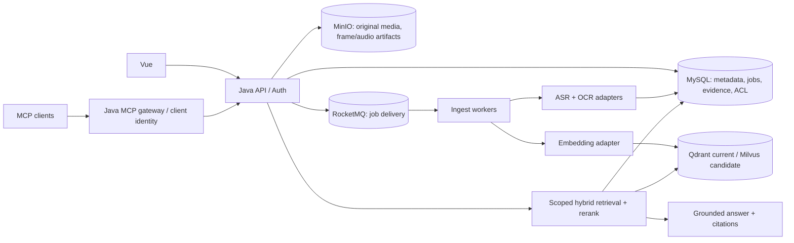

# 视频知识库后端：现状审计与目标架构

更新：2026-09-28。本文是架构方案，未表示代码已按此改造。首期业务边界已确认：个人本地知识库，供自己的 Agent 使用；以中文讲解的 B 站学习视频和课程为主，存在约 20 小时的长课程/长素材，文字信息最重要。第三方调用暂按项目现有架构设可配置开关；具体视频数、每日新增和计费预算尚未确认。

## 1. 结论与证据

目标是「上传一次视频，自动形成可追溯的时间戳知识；网页和外部 Agent 经同一授权查询能力使用」。当前工程已经有 Java ASR/OCR、MySQL segment、Qdrant、问答 API 和 4 个 MCP 工具的代码，其他空间也有真实索引；问题是**新视频从上传到可检索没有可靠的必达链路**。不能把“已有类/单测/其他语料验收”当成当前批次已入库。

2026-09-28 对截图对应的 `owner_user_id=20, space_id=14` 做只读数据库核查：13 个来源均为 `PENDING`，0 个 segment；其中 8 个找不到 `analysis_tasks` 记录，5 个任务 `FAILED/BUDGET_EXHAUSTED`。那 5 个已有 context/chunks checkpoint，可以尝试从这些中间结果继续；其余 8 个没有 checkpoint。全库另有 21 个 `READY` 来源与 691 个 segment，说明解析/入库能力并非完全不存在。后端健康端点只验证 MySQL/Redis 为 UP，不验证 MQ、MinIO、Qdrant 或模型链路。

特别注意版本：当前后端进程于 15:34 启动，而自动提交上传任务的提交 `7a03a63` 时间是 15:39；进程是否包含该改动未经过运行时构建指纹验证。工作区还有 5 个未提交改动（包括“索引先于 Agent 报告”和失败状态处理），不能据当前源码推定运行中的服务已加载这些改动。不要直接重跑 13 个视频并覆盖现场；先保存任务、checkpoint 和服务日志快照。

## 2. 会阻断业务的架构问题

| 优先级 | 问题与代码证据 | 对业务的结果 |
| --- | --- | --- |
| P0 | `MediaController.dispatchDefaultAnalysis` 把投递异常全部吞掉，且上传响应只返回 media，没有持久化 ingest job；`AnalysisDispatchService` 对限额/重复/失败仅返回枚举。 | 用户看到“上传成功”，来源却可永久 `PENDING`，无法区分未投递、排队和失败。当前 8 条无任务记录与这一类断链一致；具体触发原因仍需日志确认。 |
| P0 | 知识入库依赖 `AiService.asyncAnalyze` 的通用 Agent 报告。当前运行批次的 5 条任务耗尽 50k token，segment 为 0。源码中“索引先行”还未确认在运行进程生效。 | 知识库的基本可用性被长视频报告的 token/轮次成本绑死。 |
| P0 | `KnowledgeSegmentIndexService` 先删除 MySQL 旧 segment，再删除 Qdrant 旧点、逐条调用 embedding、写新点，最后标记 READY；删除向量失败还会被 `QdrantVectorStore.deleteSource` 吞掉。 | 重建失败可出现旧向量、新 MySQL、状态不一致；旧引用失效或错误空间命中。无可原子提交的跨存储事务。 |
| P2（多人开放前） | `McpEndpoint` 接受多个客户端 token，但 `DovideoApiClient` 使用同一静态 token/服务账号访问上游。 | 首期个人使用可维持单主体；不同用户的 Agent 无法对应各自空间和权限，多用户开放前必须重做身份绑定。 |
| P0 | `KnowledgeSearchService` 的 keyword 是 MySQL `LIKE`，先限 40 条再内存打分；未按 READY/currentVersion 限定。vector 回填也未重新校验来源当前归属、位置、状态、版本。 | 大语料召回不稳；重建/移动/删除后的陈旧结果可被使用。引用虽能验证字符串，仍不等于每条回答主张都被证据语义支持。 |
| P1 | ASR 60 秒分片失败时，只要其他分片成功即可继续；没有分片级持久化状态与缺口标记。 | 来源可能显示 READY，但内容缺少部分时间段，复跑又可能重复付费。 |
| P0 | 浏览器/服务端分片上传最多 `410 × 5 MiB ≈ 2.00 GiB`；`VideoContextService` 单次构建总等待 60 分钟，音频和画面两次 FFmpeg 调用各限 15 分钟；ASR 60 秒片段在单任务内顺序请求。 | 20 小时课程若为单文件，可能上传前就被拒绝；即使压缩后上传，仍很难通过当前单任务超时和顺序 1,200 片段处理。不能宣称支持 20 小时视频。 |
| P1 | 前端把所有 `PENDING` 且非 PROCESSING 都算“排队”，ETA 用固定公式估算；`readyCount` 统计所有非 PENDING。 | 当前 8 个未投递和 5 个失败被展示为 13 个排队，误导用户。 |
| P1 | `KnowledgeSearchService` 默认只返回 5 个候选证据，`KnowledgeAnswerGenerator` 截断长文本；MCP `ask` 未指定空间时只选默认空间，而 `search` 遍历最多 10 个空间。 | 外部 Agent 对同一自然语言问题可能在 `search` 找到证据，`ask` 却回答无证据；跨视频、跨空间学习体验不一致。 |

## 3. 推荐目标架构

保持 Java 21 / Spring Boot + Vue，复用 MySQL、MinIO、Redis、RocketMQ；优先修通确定性的知识入库，再优化检索。浏览器与 MCP 都调用同一个授权后的 Knowledge API。

### 3.1 写入路径和状态

首期按**文字优先、视频作为时间定位与可选画面证据**实现：有可用字幕/文字稿时先校验并导入原稿，补齐来源、章节与时间轴；没有时从原视频抽音频做 ASR。沿用当前配置时，60 秒音频片段会发往第三方 ASR，embedding/问答会发送文本；OCR 由本机 Tesseract 执行。界面须明确展示每项外发开关和成本估算，不能把本地 OCR 误写成“全链路本地”。

1. 上传完成时，在一个 MySQL 事务内写 `media_asset`、`knowledge_source/source_version`、`ingest_job` 和 outbox 事件；返回 `mediaId + jobId + status`。MQ 发布者异步转发 outbox，失败可重试。Redis 只做缓存/锁，不能作为投递真源。
2. 独立的 `INGEST_VIDEO` worker 消费。按 `(sourceVersionId, pipelineProfile)` 幂等；阶段为 `STORED → PROBING → TRANSCRIBING/OCR → NORMALIZING → SEGMENTING → EMBEDDING → INDEXING → READY`，异常进入 `RETRY_WAIT/FAILED/PARTIAL`。每阶段记录 attempt、错误码、耗时、成本与可恢复的 checkpoint。报告生成是可选的下游 `GENERATE_STUDY_REPORT` 任务，失败不影响 READY。20 小时单文件先按时间切成可恢复的子任务，限制并发和第三方 API 速率，再汇总成同一来源；一个子任务超时不重跑整段课程。
3. ASR 与 OCR 可并行，每个音频分片和帧都持久化 `status/time range/provider/model/hash`。任一分支失败时明确标注覆盖率与缺口；达到业务确定的最低覆盖率才可 READY，否则 PARTIAL/FAILED。断点续跑只重做失败单元。
4. 时间戳证据存 MySQL 真源：原始 ASR 文本、字幕/文字稿、OCR 文本、帧引用、来源、开始/结束时间、处理版本与质量标记。课程按 `课程 → 章节 → 课时/视频 → 原始证据 → 检索块` 组织；超长稿按章节和语义段落建立父子块，既可跨课程全局检索，也可按主题/章节缩小范围。索引单元必须保留到原始时间窗的映射。摘要是派生文本，不可取代原始证据。
5. 采用“构建新 generation → 校验 segment/向量计数与可查询性 → MySQL 切换 active generation → 异步清理旧 generation”。索引失败保留旧 READY 版本；删除、移动与权限变化必须由 API 读取 MySQL 当前状态再次校验。后台 reconciliation 对比 MySQL active generation、向量点数和过期数据，定期补写/删除。

**上传长视频**：为本地文件保留目录导入，也提供直接到 MinIO/S3 的 multipart 上传，服务端只保存上传会话和对象清单，不再把全部 5 MiB 小块下载到本机临时文件重新合并。视频 20 小时不一定比 2 GiB 大，但当前固定上限无法保障业务。读取 B 站链接时把下载、媒体探测与解析分成不同任务；一个课程的多个分集保持独立 source，共享 course/topic 归类。

**画面档位**：默认 `TEXT_FIRST`：字幕或 ASR 必选，按较疏的时间采样与场景切换提候选帧，先用感知哈希/差异过滤，再对变化显著的少量帧做本地 OCR；一段时间/一课时设置帧数与 OCR 时长上限。可选 `TEXT_ONLY`：不跑 OCR；`SCREEN_HEAVY`：为板书/代码演示提高取帧密度。普通 talking-head 视频可由自动分类降到 `TEXT_ONLY`。逐帧视觉大模型不作为首期前提。每个档位展示“预计 ASR 分钟数、OCR 帧数、embedding 字符数、可选报告 token”，并记录实际消耗。

### 3.2 检索、回答与学习

- 输入由服务端用户身份推导 `tenant/user/allowedSpaces`，不能信任客户端传入的 owner。先做 ACL/READY/active generation 过滤，再 dense + lexical 各取候选，RRF 合并；重排是否上线由评测决定。回填 MySQL 原始证据时再次验证 owner、space、version、status。
- 第一阶段给中文讲解、屏幕录制和技术术语建立题型集：事实、跨视频综合、OCR 代码、时间定位、音画冲突、域外拒答。保留 `search_evidence`（原文证据）和 `ask`（带引用答案）两种用途。支持 `open_evidence` 返回秒级时间戳与可授权播放链接；学习界面可展示转写、段落、引用回跳、错漏反馈和复习标记。
- 回答校验要检查引用 ID、原文 quote、时间窗、当前授权和版本，并按 claim 检查是否有对应证据。纯字符串匹配只能证明“引用摘自某段”，不能证明“结论正确”；引入人工 sentinel 与必要的 groundedness 评测。

### 3.3 MCP 契约

- 先保留已有的 `list_knowledge_spaces`、`search_video_knowledge`、`get_video_evidence`、`ask_video_knowledge`，补 `get_ingest_status`。稳定输出 `sourceId/segmentId/startMs/endMs/quote/answerability/indexVersion`；大结果分页或截断说明。
- 每个 MCP 凭证必须绑定主体、允许的空间、只读 scope、速率/配额与审计身份。若首期确实是单人本地服务，可先用单主体配置，但不能把同一服务账号方案当作多租户上线方案。
- 统一“省略 spaceId”的行为：显式所有授权空间，或显式默认空间，二者择一；`search` 和 `ask` 必须一致。Agent 可先查状态再提问，未入库要返回明确的 `NOT_READY`，不要伪装成“知识库无答案”。

## 4. 向量库与模型选择

**当前基线：Qdrant + 已配置的 `BAAI/bge-m3` dense embedding。** BGE-M3 官方模型卡给出 1024 维、支持多语言及 dense/sparse/多向量，但当前代码只请求 dense embedding；不要把模型能力当成系统已实现能力。将模型 ID、供应商、维度、归一化方式、prompt/profile 版本写入 `index_profile`，同一 generation 不混用模型。批量 embedding、限流、重试和实际成本统计比立即更换模型优先。

**Milvus 是候选，不是前置依赖。** 官方文档支持 BM25 文本函数、dense+sparse hybrid 和分区键。Qdrant 官方文档也支持 dense+sparse hybrid/RRF，因此“要混合召回”本身不构成迁移理由。先在现有 Qdrant 上做可复现基线；若数据量、过滤性能、写入吞吐或中文术语召回证明需要 Milvus，再通过 `VectorIndex` 接口双写、全量回灌、影子查询和小流量切读。Milvus 中文 analyzer 必须用实际中英混杂语料验证。两个库都不能替代 MySQL 的权限真源。

**首轮对照方案**：A=`bge-m3 dense + lexical`，B=`bge-m3 dense + sparse/BM25`；可选加入 `bge-reranker-v2-m3` 重排 Top 20→Top 5。固定语料、query、chunk、模型版本，比较 Evidence Recall@5、精确术语命中、跨视频覆盖、Citation Precision、拒答正确率、P95、索引吞吐和每小时视频成本。模型/库切换采用“无关键 sentinel 退化、收益满足阈值、资源可承受”门禁；阈值由业务规模确定。

资料：[BGE-M3 官方模型卡](https://huggingface.co/BAAI/bge-m3)、[Milvus BM25 文档](https://milvus.io/docs/bm25-function.md)、[Milvus 分区键](https://milvus.io/docs/use-partition-key.md)、[Qdrant 混合检索](https://qdrant.tech/documentation/search/text-search/hybrid-search/)。

## 5. 实施顺序与验收

| 阶段 | 交付 | 必须通过的验收 |
| --- | --- | --- |
| P0 现场止血 | 固定当前运行版本/日志/任务快照；区分 8 条无任务与 5 条预算失败；对有 checkpoint 的 5 条在隔离环境验证补索引；把 UI 的 `NO_JOB/FAILED` 展示准确。 | 13 条逐条有真实状态和可解释错误；不会再把失败算排队。未经快照与确认，不对原始媒体做批量重跑。 |
| P1 最小可用闭环 | 独立 ingest job/outbox/worker；上传自动投递；ASR/OCR checkpoint；知识 READY 独立于报告；索引 generation/对账；字幕/文字稿入口。 | 新上传 10 条真实视频：10 条有 job，重复上传/重复消息不重复扣费，服务重启后能继续；每条 READY 有可打开时间戳证据，故障可定位并可重试。至少一条接近 20 小时的课程拆分、暂停和续跑成功。 |
| P2 Agent 产品化 | 统一 Web/MCP Knowledge API、主体绑定和空间授权、状态工具、分页/限流/审计；优化混合检索。 | 两个不同主体的交叉空间请求均拒绝；Web 和 MCP 对同一问题得到同一证据；删除或移动后旧索引不可被返回。 |
| P3 质量与容量 | 扩大中文真实视频评测、模型/向量库 A/B、容量压测、备份恢复与告警。 | 有固定 benchmark 和运行产物；发布门禁覆盖召回、引用、拒答、时延、处理成功率、成本；再决定是否切 Milvus。 |

## 6. 待业务确认

1. 默认允许你的 Agent 跨所有授权知识空间检索，还是每次限定空间/主题？
2. 继续使用项目现有第三方 ASR（发送音频片段）和文本模型/embedding（发送文字）是否符合你的实际隐私预期？数据保留期限与单视频成本上限是多少？
3. 预计视频数量、每日新增量、平均单片时长、最大文件大小，以及“上传到可检索”可接受的时间？
4. 学习场景首期除“有引用问答 + 时间回跳 + 按课程章节检索”外，是否要摘要、测验和复习记录？这些应为可选派生任务。
